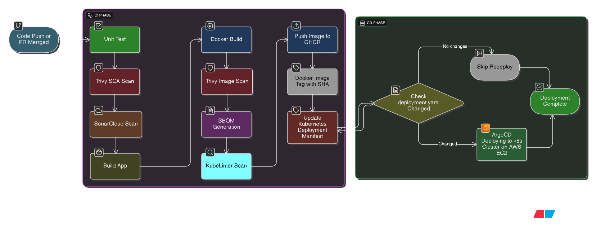

# 🎬 JioStar - DevSecOps 

## 📽️ Demo Video

[](https://vimeo.com/1095701923/f73a51dff0)
---

A modern, secure, and scalable movie browsing web application powered by **React**, running in a **Kubernetes** environment with full **CI/CD** and **DevSecOps** integration.
---

## 🚀 Features

- 🛡️ Secured Docker builds with secrets management
- 🔄 End-to-End CI/CD with GitHub Actions & ArgoCD
- ☁️ Deployed on a lightweight Kubernetes (Kind) cluster on AWS EC2
- 📦 Containerized and published using GitHub Container Registry
- 🔍 Code and container scanning with SonarCloud, Trivy & KubeLinter
- 📄 SBOM generation (CycloneDX format) for compliance

---

## 🧱 Tech Stack

- **Frontend:** React.js
- **CI/CD:** GitHub Actions, ArgoCD
- **Security:** Trivy, SonarCloud, SBOM, KubeLinter
- **Containerization:** Docker, Chainguard Node & Nginx images
- **Orchestration:** Kubernetes (Cluster on AWS EC2)
- **Secrets Management:** GitHub Secrets + K8s Secrets
- **Ingress Controller:** NGINX


## 🧪🔐 DevSecOps CI/CD Pipeline

| 🔢 Stage       | 🛠 Tool/Process                  | 🔍 Purpose/Task                                                                 | 💬 Description |
|----------------|----------------------------------|----------------------------------------------------------------------------------|----------------|
| **1. CI**       | GitHub Actions                   | Continuous Integration (CI)                                                     | Orchestrates linting, testing, scanning, building, and deployment steps upon code push to `main` branch |
| **2. Unit Testing** | `npm test`                      | Ensures code correctness                                                         | Runs tests before moving to build stage (placeholder for real tests) |
| **3. SCA (Software Composition Analysis)** | Trivy (`trivy-action@master`)           | Scans source code for vulnerabilities                                           | Detects known vulnerabilities in dependencies and transitive packages |
| **4. SAST (Static Application Security Testing)** | SonarCloud (`sonarqube-scan-action@v5`) | Analyzes code for bugs, code smells, and security vulnerabilities                | Ensures code quality and security adherence |
| **5. SBOM**     | Trivy (`--format cyclonedx`)     | Generates Software Bill of Materials                                            | Lists all software components and licenses in Docker image for compliance |
| **6. Docker Build** | `docker/build-push-action@v5`     | Builds multi-stage Docker image securely                                         | Uses Chainguard base images; builds React app → serves via NGINX |
| **7. Image Signing/Push** | GitHub Container Registry (GHCR) | Pushes tagged image (sha + latest) to secure registry                           | Pushes Docker images to `ghcr.io/codewithmitesh/jiostar-devops` |
| **8. KubeLinter** | `stackrox/kube-linter-action@v1.0.4` | Lints Kubernetes manifests                                                       | Detects misconfigurations, anti-patterns in YAML files before deployment |
| **9. K8s Patch** | `sed` in GitHub Actions          | Patches `deployment.yaml` with new image tag                                    | Ensures image version used in cluster is always the latest |
| **10. CD (ArgoCD)** | ArgoCD (auto-sync)              | Declarative GitOps CD                                                            | Detects changes to `deployment.yaml` and syncs to Kind cluster on AWS EC2 |
| **11. Deployment** | Kubernetes (Kind on EC2)        | Deploys Docker container in production                                           | 3 replicas managed via Deployment ➝ Service ➝ Ingress |
| **12. Ingress** | NGINX Ingress Controller         | Exposes the app publicly                                                         | Handles traffic routing from `jiostar.example.com` or public EC2 IP |
| **13. Secrets Management** | GitHub Secrets + K8s Secrets       | Secures API keys at build and runtime                                            | `.env` secrets injected via GitHub and Kubernetes Secret for TMDB API key |


## 🧪 Probes & Readiness

Liveness and readiness probes are configured on port `8080` to ensure healthy app state inside Kubernetes.

---

## 🔍 Linting & Security

- **KubeLinter**: Validates all Kubernetes YAML files.
- **Trivy**:
  - **SCA (Source Code Analysis)** on source
  - **Image Vulnerability Scanning**
- **SonarCloud**: Code quality and maintainability analysis.

---


## 📁 Project Structure

```
.
├── .github/workflows/ci.yaml         # GitHub Actions CI/CD pipeline
├── kubernetes/
│   ├── deployment.yaml              # Kubernetes Deployment
│   ├── service.yaml                 # Kubernetes Service
│   └── ingress.yaml                 # Kubernetes Ingress
├── Dockerfile                       # Multi-stage Dockerfile (Node ➝ Nginx)
├── build/                           # Static build files (generated)
├── src/                             # React app source code
└── README.md                        # This file
```

---

## ⚙️ Tech Stack

- **Frontend:** React
- **CI/CD:** GitHub Actions + ArgoCD
- **Containerization:** Docker + GitHub Container Registry
- **Kubernetes:** Cluster on AWS EC2
- **Security:** Trivy (SCA + image scan), KubeLinter, SBOM (CycloneDX)
- **Quality:** SonarCloud
- **Base Images:** Chainguard Hardened Images For Security

---

## 🧪 Local Development

```bash
# Clone the repo
git clone https://github.com/yourusername/jiostar.git
cd jiostar

# Install dependencies
npm install

# Add your TMDB API key to `.env` file
echo "REACT_APP_MOVIEDB_APIKEY=your_tmdb_api_key" > .env

# Run locally
npm start
```

---

## ☁️ Production Deployment Overview

Code push to `main` triggers:

1. ✅ Lint, Test, Build
2. 🔐 Trivy SCA Scan
3. 📊 SonarCloud Code Quality Check
4. 🐳 Docker Build (with `MOVIEDB_APIKEY`) and vulnerability scan
5. 📄 SBOM generation (CycloneDX)
6. 🔁 Patch Kubernetes YAML with updated image SHA
7. 🚀 ArgoCD detects changes and syncs to Kind cluster on AWS EC2

---

## 🔍 Accessing the App

If using Ingress:

```txt
http://<your-ec2-public-ip>/
```

If configured with custom domain (e.g., `jiostar.example.com`):

```txt
<your-ec2-public-ip> jiostar.example.com
```

Update your local `/etc/hosts` if needed.


## 🛡 Security Practices

- ✅ ReadOnlyRootFilesystem for containers
- ✅ `runAsNonRoot` and UID 1000 for Node/Nginx
- ✅ Trivy scans for OS & dependency vulns
- ✅ SonarCloud for lint/quality/code smells
- ✅ SBOM generation with CycloneDX
- ✅ KubeLinter check for K8s YAMLs

---


> 🔧 PRs and feedback welcome!